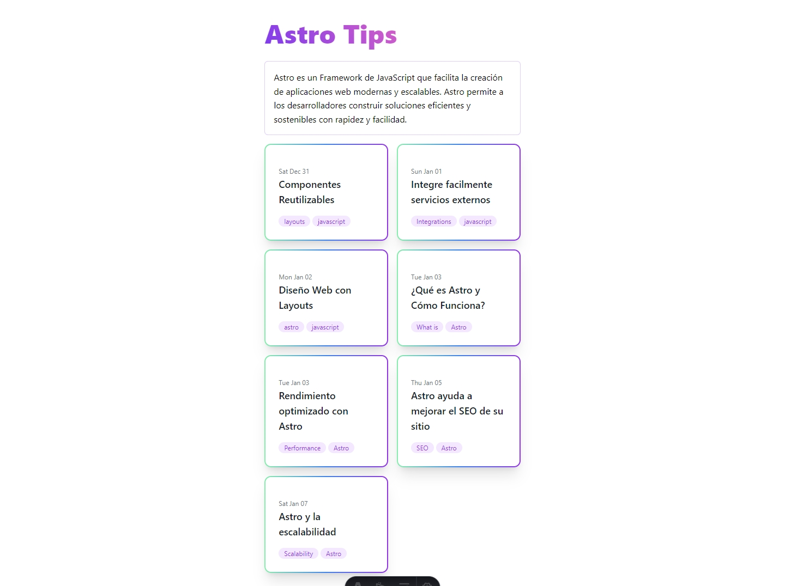
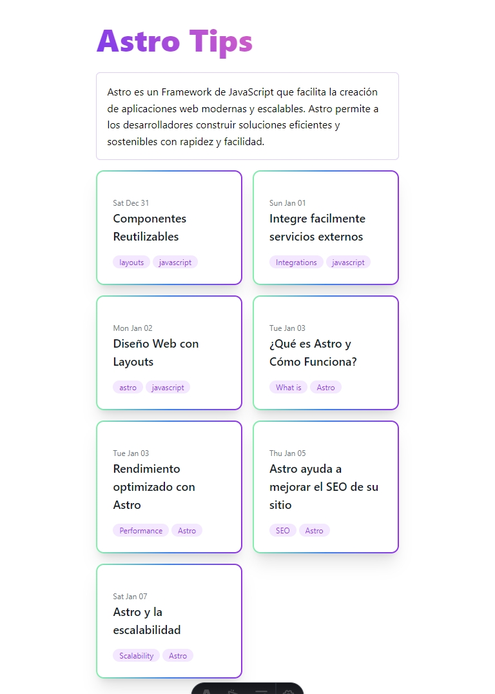
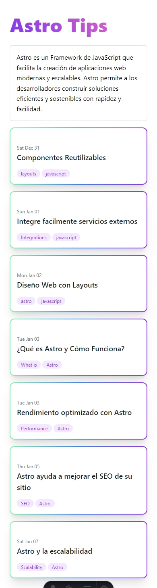

# Blog con Astro

Este proyecto es un blog desarrollado con [Astro](https://astro.build/), un moderno generador de sitios estáticos front-end.

## Vistas de la página

Aquí puedes ver cómo se ve la página en diferentes dispositivos:

### Escritorio

### Tablet

### Móvil

## Características

- Desarrollado con Astro, lo que permite una alta velocidad de carga y un excelente rendimiento.
- Diseño responsivo que se adapta a cualquier dispositivo.
- Soporte para múltiples autores.
- Comentarios y reacciones en las publicaciones.

## Instalación

Para instalar y ejecutar este proyecto, sigue estos pasos:

1. Clona el repositorio: `git clone https://github.com/yourusername/your-repo-name.git`
2. Navega al directorio del proyecto: `cd your-repo-name`
3. Instala las dependencias: `npm install`
4. Inicia el servidor de desarrollo: `npm run dev`

## Uso

Para crear una nueva publicación, añade un nuevo archivo `.md` en la carpeta `src/posts`.

## Contribuir

Las contribuciones son bienvenidas. Para cualquier cambio importante, por favor abre un issue primero para discutir lo que te gustaría cambiar.

## Licencia

[MIT](https://choosealicense.com/licenses/mit/)